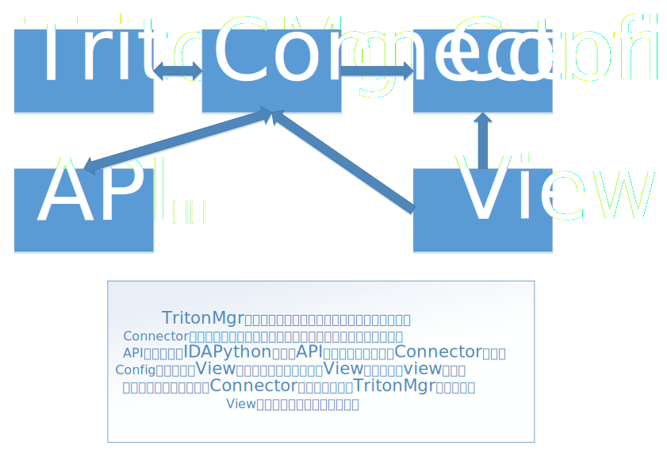

# README

> 前排：本仓库仅作为临时存放合作代码用，等团队仓库投入使用后本仓库将删除
## 插件架构

- 插件分为四（五）个基本模块
  - triton层：调用triton，完成回溯分析，是插件的核心逻辑层
  - （待定）Connector层：将triton层和API层中间插入一个中间层，中间层负责这两层间的通信，主要进行数据的封装处理。这一想法主要取决于triton层是否有足够多的数据处理代码，如果有，采用此设计可以使得底层代码更集中在回溯分析的逻辑上
  - IDA API层：包装IDApython提供的API，使被分析的文件更容易与核心的triton层交互，减少triton层的处理工作，属于一个类似helper的模块，目前这样设计理论上很容易向其他分析工具进行扩展
    - FileInfo子模块：提供被分析的二进制文件信息，通过Connector解析，供TritonMgr使用
  - view：提供插件的数据显示/GUI界面
  - config：供插件使用者自定义分析内容

- 图片说明

- 对图片的补充说明
  - Connector模块可以隐含在TritonMgr模块内

## Config模块架构说明

### 总体说明

- 将配置划分为几个子模块，为插件的配置自定义化和扩展化做准备

### 子模块说明

- BaseConfig类：插件基本属性，如设置banner、开关调试模式、开关GUI界面等
- ArchInfo类：不同架构下的函数参数规则
- FuncInfo类：待审计函数信息
- ViewInfo类（未实现）：回显信息内容与格式
